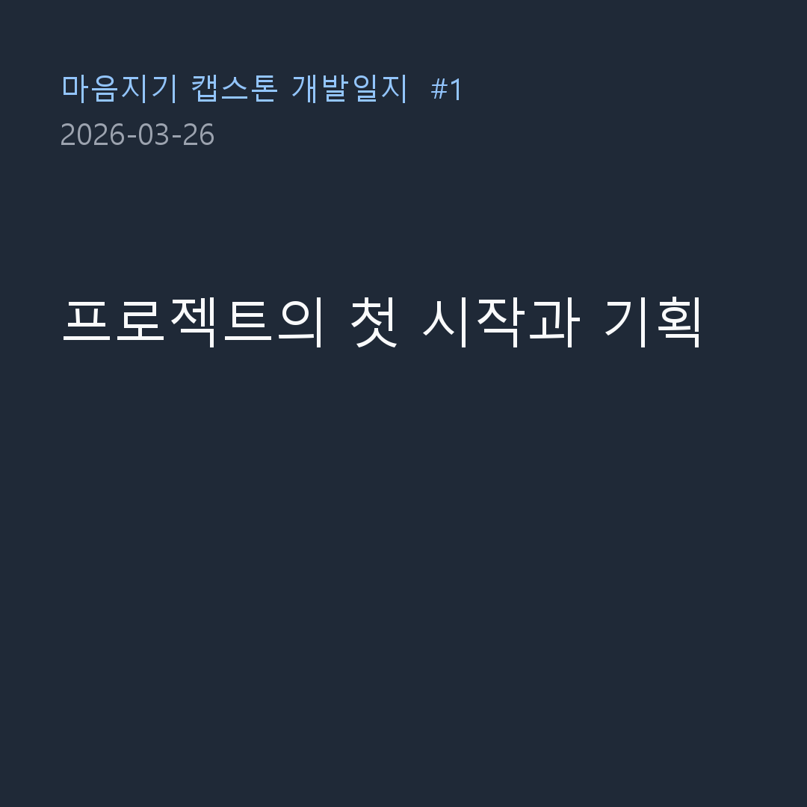
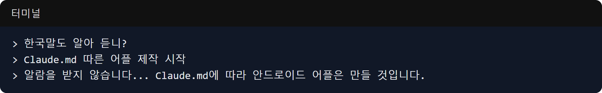

This is the record of March 26, 2026, the very first day of the grand journey of the "Maeumjigi" capstone project.
At that time, instead of the current AI-based "Maeumjigi", the project took its first steps simply as an Android alarm application.

### The First Encounter with Claude Code

- **Process**: The beginning of the project was introducing Claude Code, an AI coding assistant, to our workflow.
  > "Do you understand Korean?"
- **Result**: Starting with this light greeting, we began to seriously discuss the system architecture.

### Initial Alarm App Planning and Rule Setting

- **Problem**: The very first idea we planned was a practical Android application that crawls the reservation status of a specific website (MND Convention) and sends an alarm when an unavailable time slot changes to 'available'.
- **Process**:
  > To Claude Code: "...I'm trying to make an app that sends an alarm when a reservation becomes available. Please create a step-by-step plan for making this."
  > "We do not receive alarms... We will build the Android app according to Claude.md."
- **Result**: Based on the initial concept and planning, we wrote `Claude.md` and `CLAUDE_coding_rule.md`, which contained the development direction of the project. In particular, we clearly set the coding conventions and rules that the AI agent must follow when writing code, to prevent any confusion that could occur later when generating massive amounts of code automatically. Although this alarm app plan later took a massive turn into a completely new AI-based capstone project called 'Maeumjigi', establishing the initial project structure and collaboration rules was a crucial first step. The collaboration document templates created at this time were also very useful later during the large-scale model training process.

Today, as the first day of Capstone Design, we laid the foundation for planning ideas and communicating with AI. Please stay tuned for our upcoming spectacular series to see how this small and simple Android app plan evolves into a massive Llama fine-tuning and large-scale text synthetic data project! The process of changing the initial plan is also the beauty of Capstone Design.
