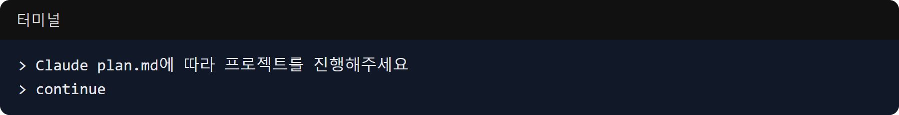

This is the record of March 30, when we officially started developing the 'MND Convention Reservation Alarm' application, which was the initial idea for the Maeumjigi project.
Based on the coding rules we set last time, we established a detailed project plan and laid the foundation for Test-Driven Development (TDD).

### Designing the Project Milestone

- **Problem**: We had the application idea, but we needed a clear step-by-step plan on how to proceed with the development.
- **Process**: 
  > To Claude Code: "Please proceed with the project according to Claude plan.md"
- **Result**: We completed a detailed project plan document called `Claude plan.md`. This document details the implementation goals for each stage, including the Android client, server structure, and crawling, and will serve as an unwavering milestone when working with AI.

### Building Test Web Pages (Fixtures)

- **Problem**: To build a crawler that detects changes on a reservation site in real-time, we would normally have to continuously connect to the actual website to test it. However, this can strain the server and create an unstable testing environment. Therefore, a mockup environment where we could test safely and freely offline was essential.
- **Process**:
  > To Claude Code: "continue"
- **Result**: The AI independently determined and perfectly created fake web page (Fixture) HTML data needed for frontend and backend testing. By precisely generating `sample_page.html` (fully booked status) and `sample_page_changed.html` (available status due to cancellations), a strong foundation was laid to quickly and safely test whether the server-side crawler code normally detects changes in HTML DOM elements.

Today was a day to truly glimpse the beauty of 'AI-driven automated development', where instead of human step-by-step instructions, we simply told the AI to "proceed according to plan," and it independently broke down the milestones and created the necessary test data and documentation.
Please continue to watch our rough (?) journey to see how this simple alarm app project transforms into a massive Deep Learning and LLM-based capstone project!
