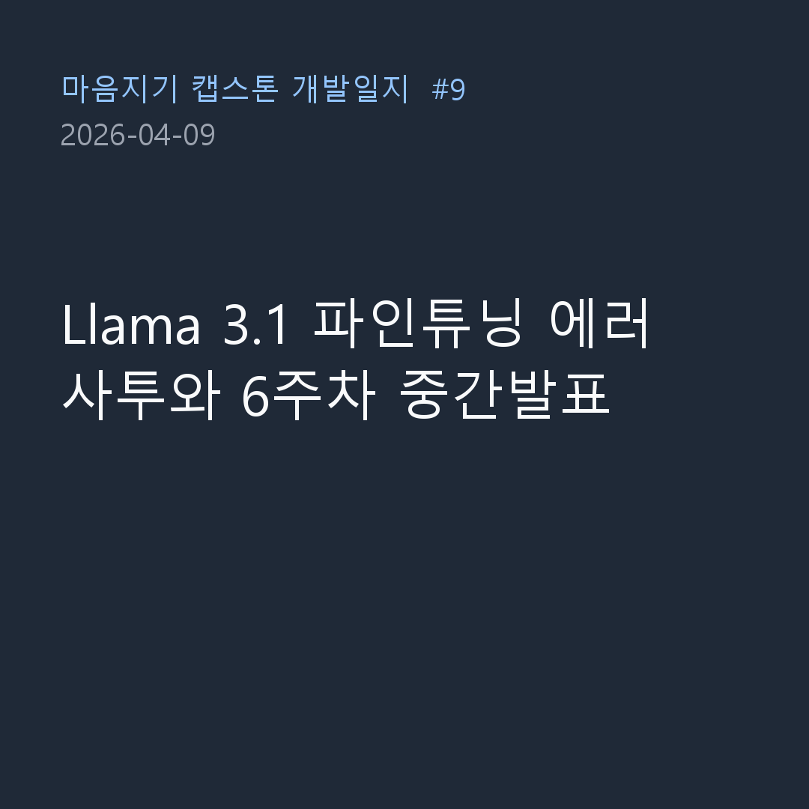
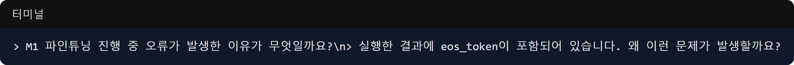

On April 9, using the Colab notebook we ambitiously completed yesterday, we finally attempted the first training (fine-tuning) of our artificial intelligence model (Llama 3.1). However, reality was not that easy, and we had to face numerous errors. It was also a tough day as we had to simultaneously create the presentation materials for the 6th week of the Capstone Design project.

### The Endless Struggle with Colab Fine-Tuning Errors

- **Problem**: As soon as we executed `llama31_finetuning_colab.ipynb` created yesterday, various errors poured out.
- **Process**: 
  > "Why is an error occurring during M1 fine-tuning in llama31_finetuning_colab (3).ipynb?"
  > "The executed result contains the eos_token. Why is this problem occurring?"
- **Result**: A series of problems occurred, such as the special token (`eos_token`) not being processed correctly when the AI model spit out the training data, and memory overflow issues. We repeated the process of copying and pasting the entire error log to Claude to get solutions and modifying the code multiple times. Finally, after many twists and turns, the training was completed, and we were able to extract a meaningful result graph called `학습데이터별학습결과.png`!

### The AI Assistant's Presentation (PPT) Creation

- **Problem**: While staying up all night training the model, we had to immediately create a PPT on the 6th-week frontend and database progress for the presentation next week.
- **Process**:
  > "Capstone_Week6_Frontend.pptx is a collection of images introducing the overview so far. Please use this to create a presentation for this week's progress."
  > "Please express the tables of the database design so that the relationships can be seen, referring to the tables implemented in the backend... The table is too large and messy. Please place the User table in the center."
- **Result**: Surprisingly, the AI wove the frontend image screenshots together to create a presentation script and slide skeleton. Even when I persistently gave feedback (centering the User table) asking it to draw a complex database ERD (Entity Relationship Diagram) based on the backend code, it perfectly organized and explained the database relationship diagram.

Today was a day to feel the thrill of directly tuning the latest language model called Llama 3.1 with my own hands (and the AI's brain). At the same time, we are learning how to fully utilize AI not only for coding but also for creating presentation materials and designing DB architecture diagrams. How smart has our Maeumjigi AI become? We will reveal the test results next time!
