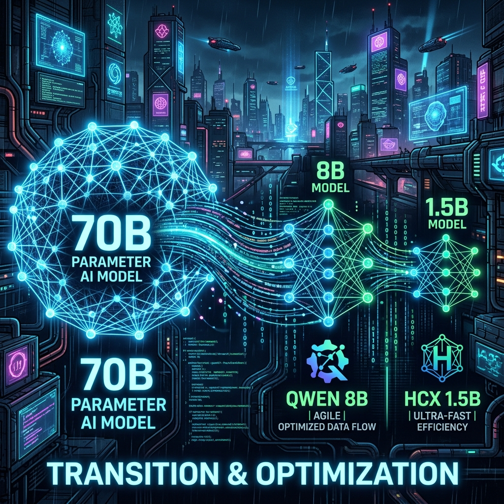

After experiencing the OOM (Out of Memory) hell during the fine-tuning of massive 70B models, on May 4th, we attempted a bold change in strategy. By drastically reducing the batch size, we barely managed to push the 70B models (Llama3.3, DeepSeek-R1) to `checkpoint-1200` and `1300`, but the training time was absurdly long, resulting in terrible efficiency.

### Pivoting to Mid-Size Models (1.5B ~ 9B)

Considering our physical server resources and the capstone project deadline, we decided it was too risky to rely solely on the 70B models. Therefore, we shifted our focus to relatively lighter mid-size models like **HCX-Omni-8B, Qwen35-9B, and HCX-Text-1.5B**.

> "It's taking a long time to train HCX-Omni-8B, Qwen35-9B, and HCX-Text-1p5B with the current hyperparameters. Are these parameters generally used for these models?"
> "How does increasing the batch size affect the training?"

Things weren't perfectly smooth just because the models were smaller. To speed up training, we increased the batch size and endlessly debated with the AI to find the optimal hyperparameters for each model size. We first evaluated the training results of the smallest model, HCX-Text-1.5B, to set our tuning direction.

### Checkpoint Saving Errors and Kernel Version Issues

While smoothly training HCX-Omni-8B, we hit another snag while trying to save a checkpoint at step 50.

```python
[RANK 0] Detected kernel version 5.4.0, which is below the recommended minimum of 5.5.0; this can cause the process to hang.
...


JSONDecodeError Traceback (most recent call last)
---> 60 trainer.train(resume_from_checkpoint=...)
```

Along with a warning that the OS kernel version was too low and could cause the process to hang, we faced a horrific `JSONDecodeError` because the saved checkpoint file was corrupted, preventing us from resuming training.

> "If the models stop during training, do they resume from where they stopped?"

Fortunately, the Hugging Face `Trainer` provides a feature to resume training from checkpoints (`resume_from_checkpoint`), but it's useless if the checkpoint file itself is corrupted. Despite reducing the model size, we spent the entire day wrestling with numerous framework and infrastructure errors. Will we ever reach a stable training orbit?
