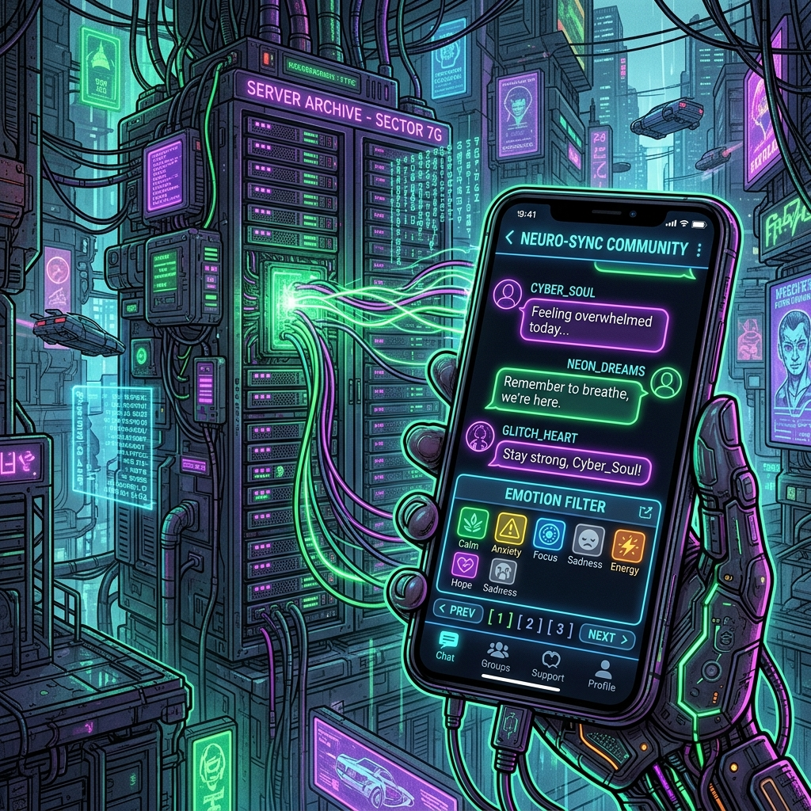

As we entered June, the Maeumjigi team completed the major developments of the 1st semester Capstone project and focused entirely on building **safety nets** and preparing for the **final presentation**.

### The Victory of the 2:1 Ratio and the Safety Wrapper

> "What was our chosen model?"
> "We decided on 2:1. Now design a method to use a safety_wrapper as a safety lock for our Main LLM (2:1)."

As a result of the 4th fine-tuning, we selected the model mixed with a 2:1 ratio of 'emotional' to 'daily' chat as our final LLM. However, given the nature of a suicide prevention chatbot, we could not allow even a single hallucination or fatal wrong answer.

To prevent this, we introduced a **Safety Wrapper**. It verifies the input and output of the LLM, and if a high-risk situation (Active Suicidality) is detected, the architecture instantly switches to a pre-defined crisis response protocol.

### Cloud Server (EC2) Budget and Final Presentation

> "We need an AWS EC2 quote. What's the budget for 5 months of g5.2xlarge?"
> "Draft the 1st_semester_final_presentation.pptx based on our progress!"

We calculated the Amazon EC2 GPU server budget to run the verified chatbot for 5 months during the summer vacation.

And on June 18th, we gathered all the achievements of our backend, frontend, and AI to complete the **1st Semester Final Presentation (PPTX)**!

The long and arduous 1st semester of the Maeumjigi Capstone development has successfully concluded. We will deploy the system to the server over the summer and return with a more advanced service in the 2nd semester!
