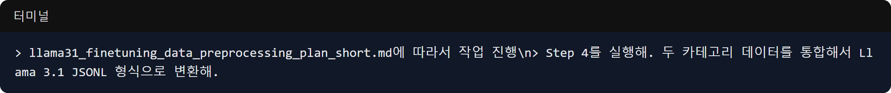

Este es el registro del 1 de abril, cuando comenzamos a procesar una enorme cantidad de datos de conversación en un formato adecuado para entrenar el modelo Llama 3.1, que se convertirá en el motor central del proyecto Maeumjigi.

### Ejecución Automatizada Según el Plan de Preprocesamiento

- **Problema**: Para realizar el ajuste fino (fine-tuning) del modelo, los datos en bruto que contenían las expresiones del usuario y las respuestas del chatbot debían convertirse perfectamente en un formato JSONL especial que Llama 3.1 pueda entender.
- **Proceso**: 
  > A Claude Code: "Proceda con el trabajo de acuerdo con llama31_finetuning_data_preprocessing_plan_short.md"
- **Resultado**: Basándose en el documento del plan de preprocesamiento escrito ayer, el agente de IA construyó y ejecutó de forma independiente la canalización de limpieza y procesamiento de datos. En lugar de que un humano convirtiera manualmente decenas de miles de puntos de datos uno por uno, simplemente entregamos un solo documento Markdown con las reglas y le indicamos: "Procésalo exactamente así".

### Integración de Datos de Categoría y Conversión JSONL

- **Problema**: El proceso de preprocesamiento se dividió en varios pasos y, finalmente, todos los datos debían combinarse en uno para completar el conjunto de datos de entrenamiento.
- **Proceso**:
  > A Claude Code: "Ejecute el Paso 4. Integre los datos de las dos categorías y conviértalo al formato Llama 3.1 JSONL."
- **Resultado**: La IA ejecutó inmediatamente el Paso 4 y fusionó los datos de conversación dispersos de cada categoría en uno solo. Luego escribió y ejecutó un script para convertirlo en un archivo JSONL, adhiriéndose estrictamente a la plantilla de comandos (prompt) precisa requerida por Llama 3.1 (diferenciando los roles de Sistema, Usuario y Asistente).

Hoy es el día en que el 'preprocesamiento de datos', el núcleo del fine-tuning, comenzó a ejecutarse de forma totalmente automática a través de la IA. Fue una experiencia mágica ver innumerables puntos de datos transformados en un estado entrenable con una sola instrucción: "Hazlo exactamente como está escrito en el documento".
En la próxima publicación, continuaremos con emocionantes registros de desarrollo sobre cómo entrenamos y validamos realmente el modelo utilizando estos datos preprocesados.
