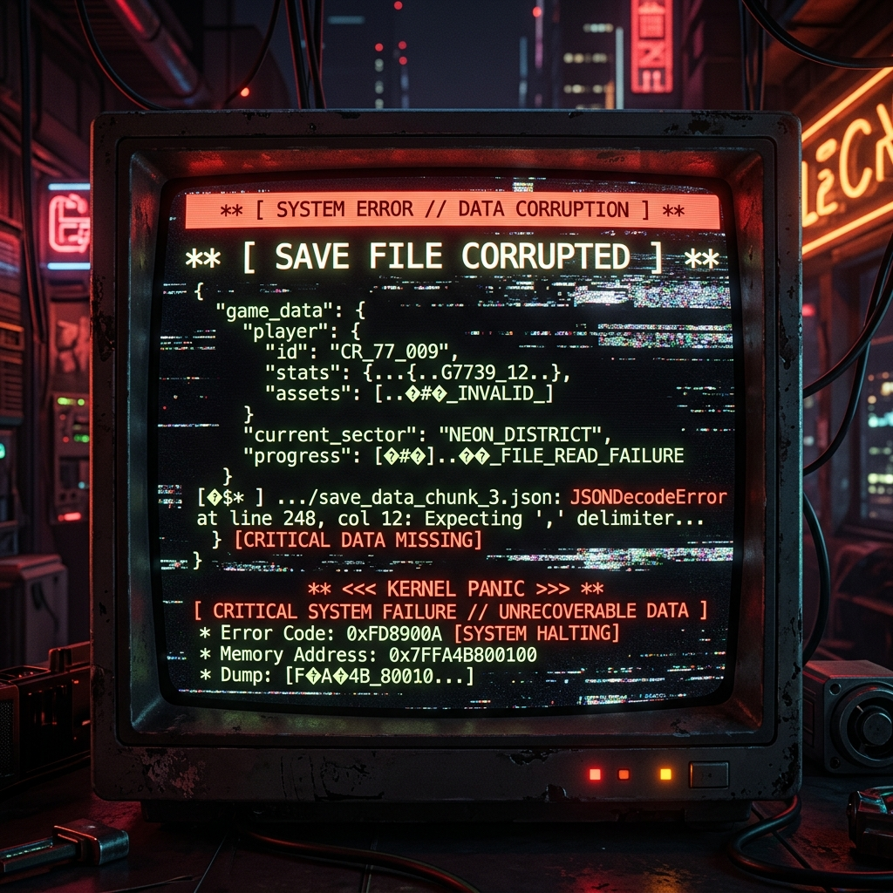

Después de experimentar el infierno del OOM durante el entrenamiento de los masivos modelos de 70B, el 4 de mayo intentamos un cambio audaz de estrategia. Reduciendo drásticamente el tamaño del lote, apenas logramos empujar los modelos 70B a `checkpoint-1200`, pero el tiempo de entrenamiento fue absurdamente largo.

### Girando hacia Modelos Medianos (1.5B ~ 9B)

Considerando nuestros recursos, decidimos que era demasiado arriesgado depender únicamente de los modelos de 70B. Por lo tanto, cambiamos nuestro enfoque a modelos medianos relativamente más ligeros como **HCX-Omni-8B, Qwen35-9B y HCX-Text-1.5B**.

> "¿Cómo afecta el aumento del tamaño del lote al entrenamiento?"

Aumentamos el tamaño del lote y debatimos interminablemente con la IA para encontrar los hiperparámetros óptimos. Primero evaluamos los resultados del modelo más pequeño, HCX-Text-1.5B, para establecer nuestra dirección.

### Errores al Guardar Checkpoints

Mientras entrenábamos suavemente el HCX-Omni-8B, tuvimos un problema al intentar guardar un checkpoint en el paso 50.

```python
[RANK 0] Detected kernel version 5.4.0, which is below the recommended minimum of 5.5.0...


JSONDecodeError Traceback (most recent call last)
---> 60 trainer.train(resume_from_checkpoint=...)
```

Junto con una advertencia del kernel del sistema operativo, enfrentamos un horrible `JSONDecodeError` porque el archivo del checkpoint guardado estaba corrupto, impidiéndonos reanudar el entrenamiento. A pesar de reducir el tamaño del modelo, pasamos el día luchando con errores de infraestructura.
