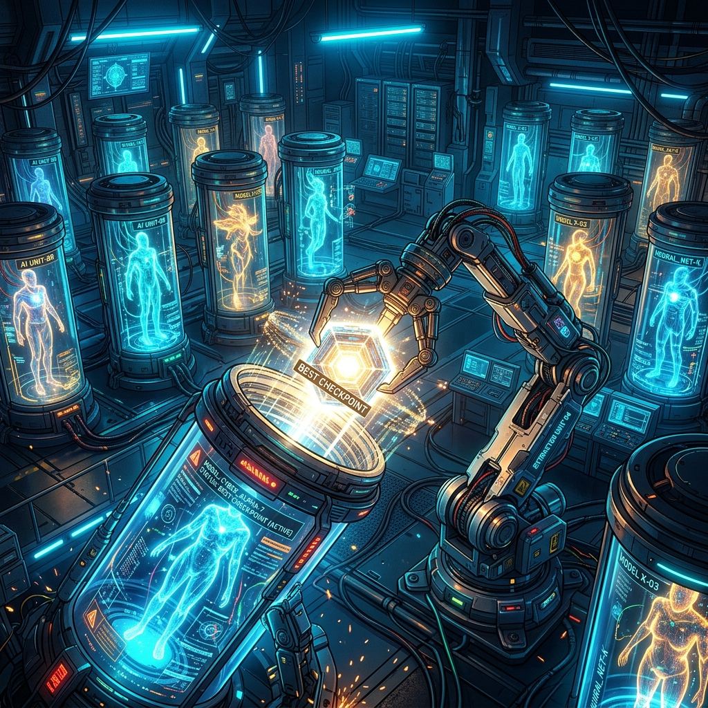

¡El entrenamiento paralelo del 2do fine-tuning (`fine_tuning_2`), que comenzó para corregir el error de los hiperparámetros, finalmente terminó el 12 de mayo!

### El Mejor Checkpoint y el Pipeline de Inferencia

El fine-tuning de 3 modelos con 6 combinaciones de hiperparámetros se completó. Comparé el `eval_loss` para extraer los mejores checkpoints y los moví a las carpetas `adapter`.

> "Los modelos HCX-Text-1p5B generaron 12 salidas en 15 minutos. Uso de GPU es de 1.6GB..."

Sin embargo, la velocidad de inferencia era desesperante. Hubo un cuello de botella porque el tamaño del lote se estableció en 1. Además, los problemas de almacenamiento del servidor nos obligaron a migrar la ruta del proyecto.

### Cayendo en la Trampa del Hardcoding

Después de ejecutar laboriosamente todos los códigos de evaluación, descubrí un hecho horrible.

> "¿Por qué MODEL_ALIAS está codificado de forma rígida a 'Qwen35-9B_a16'?"

Accidentalmente codifiqué de forma rígida `MODEL_ALIAS`. El script copiaba archivos diligentemente para probar el modelo HCX, pero dentro del código, ¡seguía cargando solo el modelo `Qwen35-9B` y repitiendo la misma inferencia una y otra vez! Mañana tendré que arreglar este error y volver a ejecutar las inferencias.
