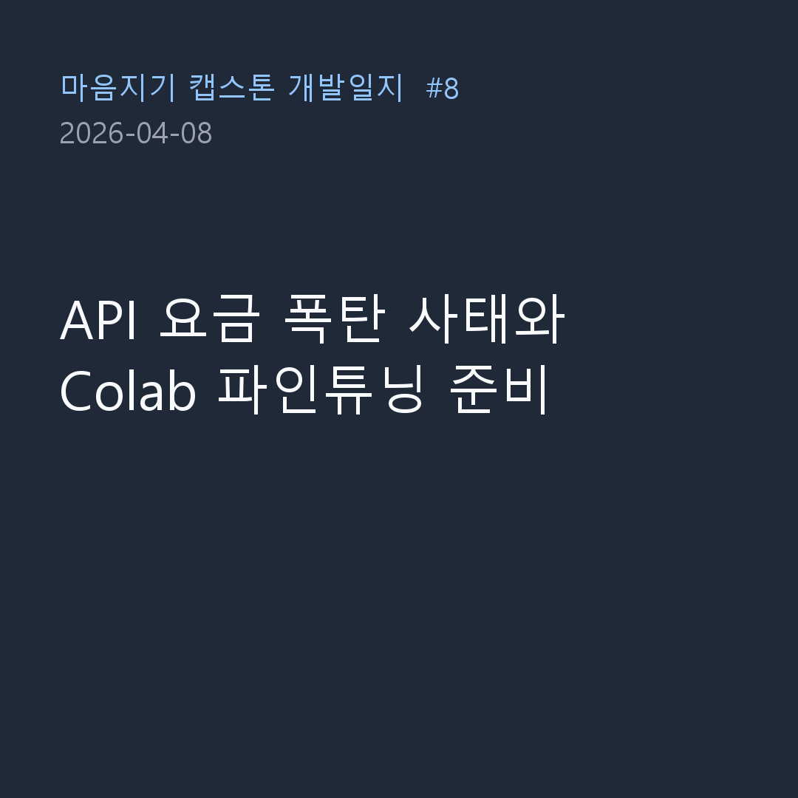

4月8日は、マウムジギプロジェクトを進める中で最大の危機であり、「笑えない」ハプニングが発生した日です。それはまさに**Claude API月間限度額超過および料金爆弾事件**です。

### バックグラウンドの裏切り：「10件生成に1ドルだと？」

- **問題**: 昨日最適化を終えたと安心し、大規模なテストデータセット生成スクリプトをバックグラウンドでオンにしたまま放置しました。
- **過程**: 
  > 「問題：月間限度額を超過して費用が請求されている。バックグラウンドでAPIが動いていると思って放っておいたらこんなことになった。」
  > 「いや、10件生成するのに1ドル消費されるなんてあり得るか？」
- **結果**: LLMを使って高品質のカウンセリングデータを合成（Synthesis）する過程で、プロンプトのコンテキスト（入力トークン）が蓄積され、コストが幾何級数的に増加したのです。月間決済限度額を超過してスクリプトが停止する事態が発生し、結局AIに「リアルタイムで予想消費量と費用、進行状況をコンソールに出力し、限度額超過を防止する機能を今すぐ追加しろ」と緊急指示を下しました。クラウドやAPIを使用する際、料金モニタリングがどれほど重要か骨身に染みて感じました。

### Llama 3.1訓練のためのColabノートブック作成

- **問題**: データが準備されつつあるので、今度は実際にLlama 3.1モデルをファインチューニング（Fine-Tuning）するコードが必要でした。ローカルPCのGPUでは到底足りないため、Google Colab環境を使用しなければなりませんでした。
- **過程**:
  > 「llama31_finetuning_experiment_plan_revised.mdをColabで進行するためのpython notebookを作成してください。」
  > 「訓練dataをtrain/val/testではなくtrain/valにのみ分割し、9:1の比率で分ける。」
- **結果**: AIが自ら訓練計画書を読み、`llama31_finetuning_colab.ipynb`という完璧なJupyter Notebookコードを書いてくれました。Unslothなどの最新軽量化ライブラリをセットアップし、データセットを9:1の比率で分割して学習と検証に使用するロジックまで完璧に実装しました。

今日はAPI料金爆弾という恐ろしい通過儀礼を経て、プロジェクトの現実的な壁を乗り越えた一日でした。しかし、その代償として素晴らしいデータセットとファインチューニング用のColabノートブックが完成しました。ついに次の段階は、本物の人工知能モデルを訓練（Training）することです！
