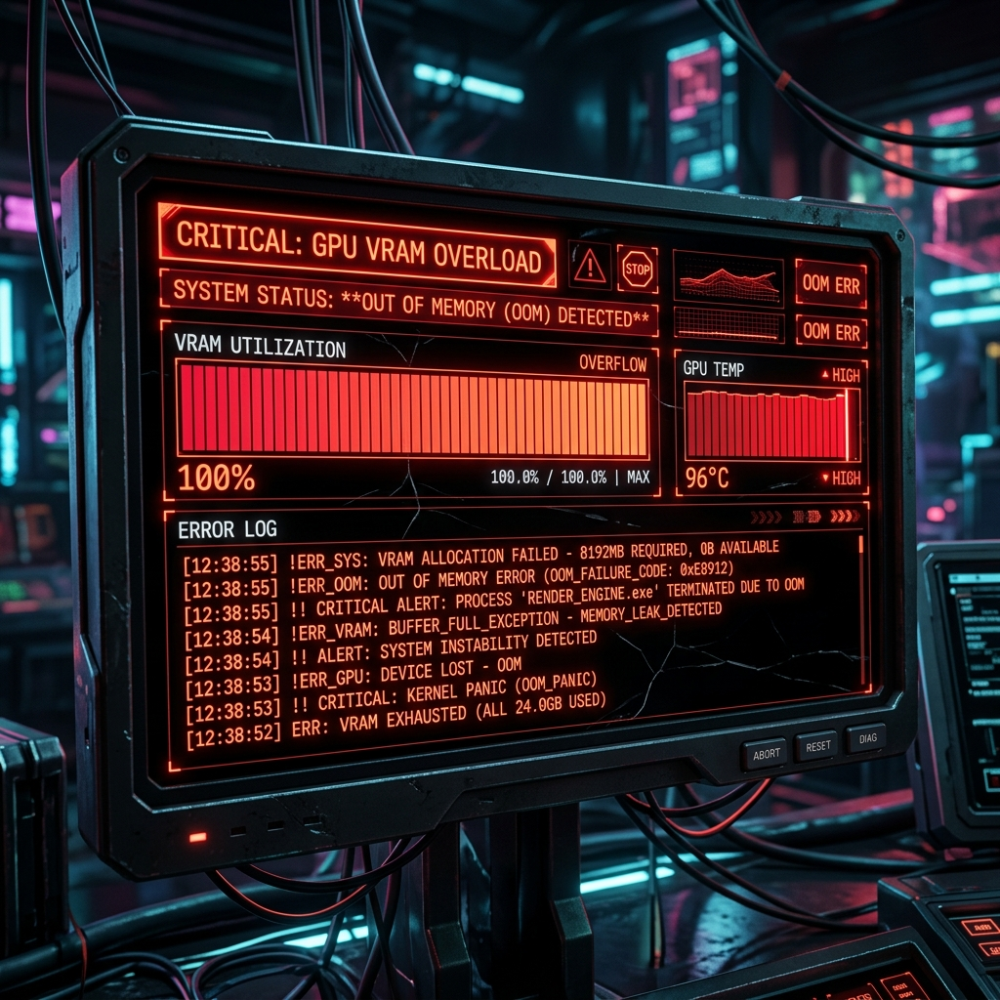

5月3日、これまで8Bモデルで十分に感覚を掴んだ私たちのチームは、ついに真のパフォーマンスの王様、**70B（700億パラメータ）**超大型モデルのファインチューニングに挑戦しました。Llama 3.3 70BとDeepSeek-R1 70Bの2つのモデルを対象に学習を試みましたが、予想通り膨大なハードウェアリソースの壁にぶつかってしまいました。

### 70Bモデル、そしてOOM（Out of Memory）の恐怖

- **問題**: 意気揚々とサーバーに70Bのファインチューニングコードをアップロードして実行するやいなや、エラーが頻発し始めました。
- **過程**: 
  > 「サーバーのfine_tuningフォルダとサブファイルをコピーしました。コピーしたファイルを確認後、エラーの原因を把握して。」
  > 「DeepSeekの70Bモデルは修正しなくてもいいのか？エラーの可能性を確認願う。」
- **結果**: `train_log.jsonl`を分析しながら残りの予想所要時間を尋ねる余裕もつかの間、70BモデルがGPUメモリをあっという間に飲み込んでしまいました。（OOMエラー発生！）

### GPUメモリダイエット作戦

- **問題**: 「すでにGPU memoryの使用量はMAXだ。」どうにかしてメモリ使用量を減らさなければ、学習が止まらずに回ることはできませんでした。
- **過程**:
  > 「save_steps = 50, save_total_limit = 10, eval_steps = 50, patience = 10 に修正。」
  > 「設定したearly stopping条件について評価願う。」
  > 「ft_configs.yamlで70Bの2つのモデルのmax_seq_lengthを512に設定したが、サーバーのnvitopでは依然としてmemoryがmaxで使用されている。なぜか？」
- **結果**: 一度に処理する文脈の長さ（`max_seq_length`）を512に思い切って減らし、不要な保存を減らすためにハイパーパラメータを大幅に修正しました。しかし、`nvitop`でモニタリングしてみると、依然としてVRAMは限界値に達してあえいでいました。挙句の果てには、ステップ100、150付近で止まり続けるという恐ろしい現象が繰り返されました。

70Bという巨大な獣を飼いならすのは本当に簡単ではありません。AIにひたすらエラーログを投げながら解決策を探していますが、物理的なVRAMの限界をソフトウェアの最適化手法（LoRA、量子化など）で克服できるのか、終わりのないテストが必要そうです。果たして私たちは70Bモデルのファインチューニングに成功できるのでしょうか？次の日誌に続きます！
