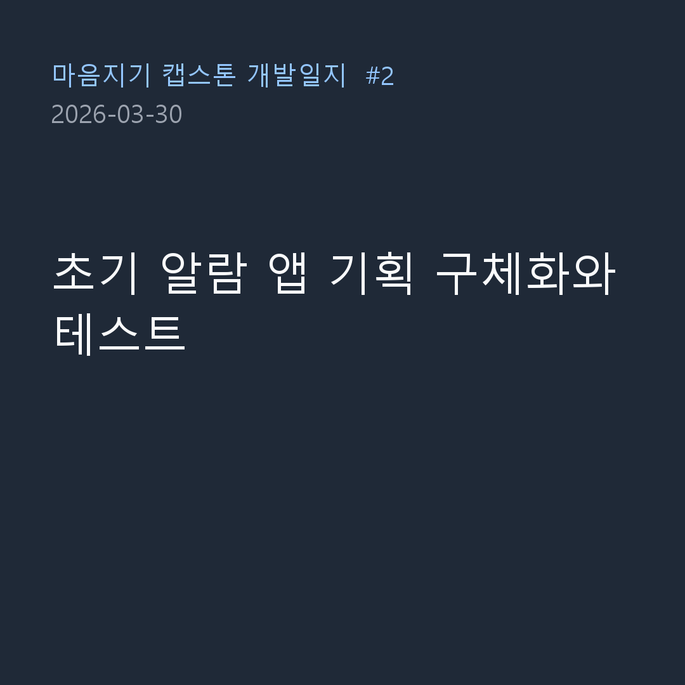

마음지기 프로젝트의 초기 아이디어였던 '국방컨벤션 예약 알람' 애플리케이션의 개발을 본격적으로 시작한 3월 30일의 기록입니다.
지난번 세웠던 코딩 규칙을 바탕으로 구체적인 프로젝트 진행 계획을 수립하고, 테스트 주도 개발(TDD)을 위한 기반을 다졌습니다.

### 프로젝트 마일스톤 설계

- **문제**: 애플리케이션 기획은 있었으나, 구체적으로 어떤 순서로 개발을 진행할지 명확한 단계별 계획이 필요했습니다.
- **과정**: 
  > Claude Code에게: "Claude plan.md에 따라 프로젝트를 진행해주세요"
- **결과**: `Claude plan.md`라는 프로젝트 상세 계획 문서를 완성했습니다. 이 문서에는 안드로이드 클라이언트와 서버 구조, 그리고 크롤링 등 각 단계별 구현 목표가 상세히 적혀 있으며, AI와 함께 작업할 때 흔들리지 않는 이정표 역할을 하게 됩니다. 

### 테스트용 웹페이지(Fixture) 구축

- **문제**: 예약 사이트의 변화를 실시간으로 감지하는 크롤러를 만들기 위해서는, 실제 웹사이트에 지속적으로 접속하며 테스트해야 합니다. 하지만 이는 서버에 무리를 줄 수 있고 불안정한 테스트 환경을 만듭니다. 따라서 오프라인 환경에서도 마음껏 안정적으로 테스트할 수 있는 목업(Mockup) 환경이 필수적이었습니다.
- **과정**:
  > Claude Code에게: "continue"
- **결과**: AI가 스스로 판단하여 프론트엔드와 백엔드 테스트에 필요한 가짜 웹페이지(Fixture) HTML 데이터들을 완벽하게 만들어냈습니다. `sample_page.html`(예약이 꽉 차서 불가능한 상태)과 `sample_page_changed.html`(취소표가 발생해 예약이 가능해진 상태)을 정밀하게 생성해 두어, 서버 측 크롤러 코드가 정상적으로 HTML DOM 요소의 변화를 감지하는지 빠르고 안전하게 테스트할 수 있는 강력한 기반이 마련되었습니다. 

오늘은 사람이 일일이 지시하지 않고 단지 AI에게 '계획에 따라 알아서 진행해'라고 지시했을 때, AI가 스스로 마일스톤을 쪼개고 필요한 테스트 데이터와 문서까지 척척 만들어내는 'AI 주도형 자동화 개발'의 묘미를 제대로 엿본 날이었습니다. 
이후 이 단순한 알람 앱 프로젝트가 어떻게 거대한 딥러닝과 언어모델 기반의 캡스톤 프로젝트로 변모해 가는지, 앞으로의 험난한(?) 과정을 계속 지켜봐 주세요!
