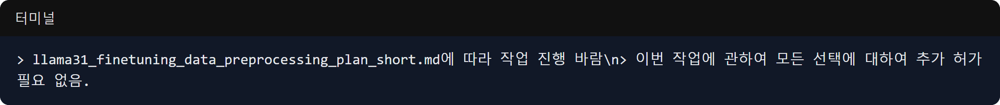

마음지기 프로젝트의 초기 방향이었던 국방컨벤션 예약 알람 앱의 안드로이드 빌드 테스트를 진행하는 동시에, 
본격적으로 인공지능 기반 프로젝트로의 전환을 암시하는 **Llama 3.1 파인튜닝 데이터 전처리**를 처음 시작한 3월 31일의 기록입니다.

### 안드로이드 앱 빌드 및 유닛 테스트

- **문제**: 어제 기획하고 생성했던 서버와 안드로이드 클라이언트 코드가 실제로 안드로이드 스튜디오 환경에서 정상적으로 빌드되고 테스트를 통과하는지 확인해야 했습니다.
- **과정**: 
  > Claude Code에게: "현재 진행 상황 ... 모든작업중단 ... 무슨 작업을 하고 있었는가?"
- **결과**: `mnd-reservation-alarm/android/app/build/...` 경로에 수많은 빌드 산출물과 메타데이터가 생성되었습니다. `NotificationBuilderTest` 등의 유닛 테스트를 실행하고, 디버그 리소스 병합, 매니페스트 처리 등 안드로이드 고유의 빌드 파이프라인을 점검했습니다. 앱 백그라운드에서 예약 변화를 감지해 알림을 띄우는 핵심 로직들이 테스트되었습니다.

### 거대한 전환점: Llama 3.1 파인튜닝 전처리 시작

- **문제**: 단순한 알람 앱을 넘어, 사용자(장병)의 예약 맥락과 감정 상태를 이해하는 고도화된 AI를 접목하기 위한 준비가 필요했습니다. 
- **과정**:
  > Claude Code에게: "llama31_finetuning_data_preprocessing_plan_short.md에 따라 작업 진행 바람"
  > "이번 작업에 관하여 모든 선택에 대하여 추가 허가 필요 없음."
- **결과**: 프로젝트의 성격을 완전히 뒤바꿀 중요한 첫걸음을 내디뎠습니다. Llama 3.1 모델을 파인튜닝하기 위한 데이터 전처리 계획서에 따라 작업을 지시했습니다. 특히 작업 속도를 높이기 위해 AI에게 "모든 선택에 대해 추가 허가를 묻지 말고 즉시 실행하라"는 강력한 권한을 부여하며 방대한 데이터 처리 파이프라인 가동을 시작했습니다. 

이날은 알람 앱의 완성도를 높이는 안드로이드 빌드 작업과 동시에, 미래의 핵심 기능이 될 AI 파인튜닝 데이터 전처리가 병렬로 시작된 뜻깊은 날이었습니다. 
다음부터는 수만 건의 대화 데이터를 Llama 3.1에 맞게 가공하는 험난한 전처리 과정이 본격적으로 펼쳐집니다!
