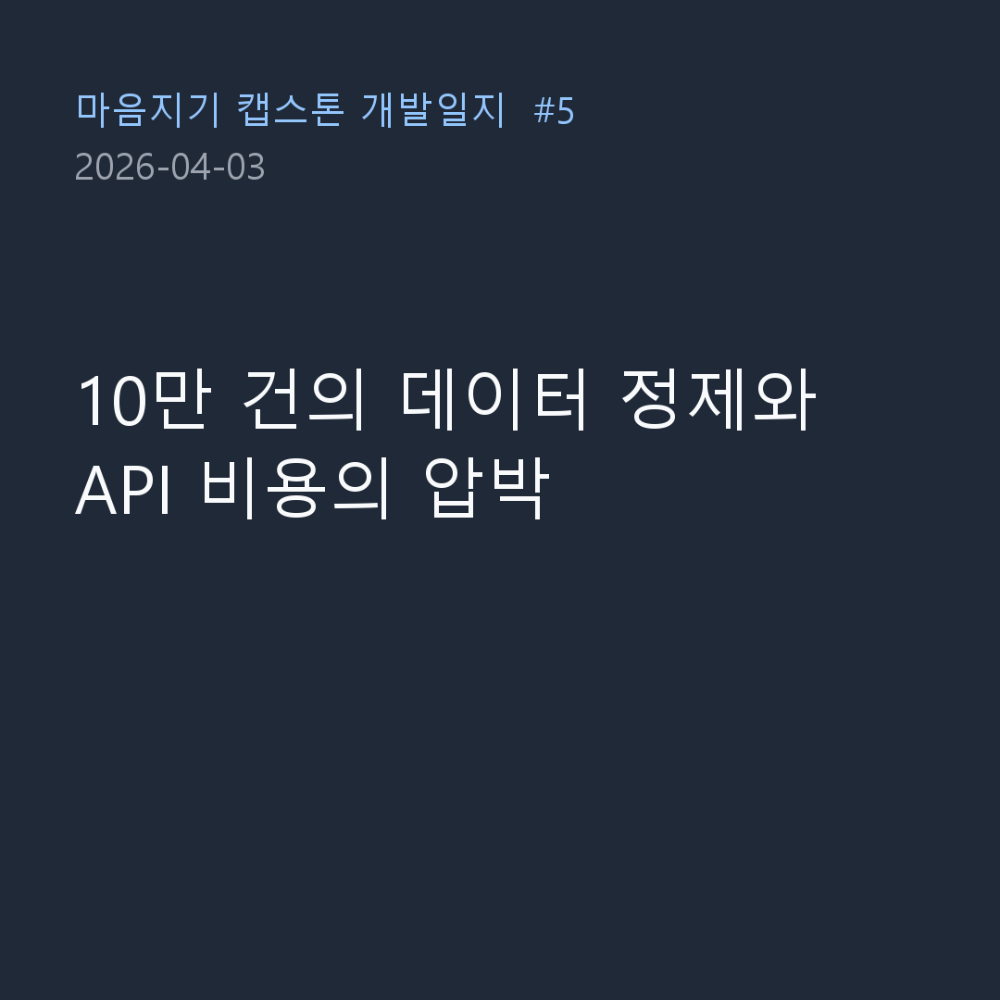

4월 3일, 본격적으로 딥러닝 모델(Llama 3.1)에 먹일 훈련용 대화 데이터를 정제하는 작업에 착수한 날의 기록입니다. 
단순히 데이터를 합치는 것을 넘어, AI가 텍스트를 보고 스스로 감정을 판별하게 만드는 거대한 파이프라인을 돌려본 날이기도 합니다.

### 데이터 감정 재분류 (v3 -> v4)

- **문제**: 기존 데이터셋(`Emotion_train_dataset_v3`)의 감정 라벨링이 우리가 원하는 세밀한 심리상담 목적에 정확히 부합하지 않았습니다. 총 100만 건의 데이터 중 의미 있는 데이터만 필터링하고 정확한 감정을 매핑해야 했습니다.
- **과정**: 
  > "범위는 전체 100만 건입니다... Claude가 심리상담 전문가로서 대화를 읽고 직접 감정을 매핑할 것이기 때문입니다. 감정 분류 내 포함되지 않는 것은 제외하고 포함되는 것만 필터링하는 것입니다."
- **결과**: `v4_plan.md`를 세우고 작업을 시작했습니다. 1차적으로 10만 줄의 데이터를 대상으로 Claude API를 연동하여 대화 맥락을 파악하고 감정을 재분류하는 스크립트를 작성하여 가동했습니다.

### LLM API 과금의 공포

- **문제**: 방대한 텍스트 데이터를 LLM(Claude)에게 던져주고 판별하게 만들다 보니, API 사용량(토큰 수)이 기하급수적으로 늘어나는 문제가 발생했습니다.
- **과정**:
  > "이미 Pro 구독으로 Claude를 사용 중인데 API가 별도로 필요하나요?"
  > "Anthropic API가 아닌 Claude Code를 사용하는 방법은 없나요? 과금이 부담스럽습니다."
  > "실제 비용은 10.27 달러가 나왔습니다."
- **결과**: Claude Pro 구독(월 20달러)과는 별개로, 파이썬 스크립트에서 자동화로 대량의 데이터를 처리하기 위해 호출하는 Anthropic API는 사용량만큼 종량제로 과금된다는 뼈아픈 사실을 체감했습니다. 단 10만 줄을 테스트로 처리하는 데에만 순식간에 약 14,000원($10.27)이 과금되었습니다. 100만 건을 모두 처리하려면 엄청난 비용이 든다는 것을 깨닫고, 모델 최적화와 데이터 샘플링의 중요성을 몸소 배운 하루였습니다.

오늘은 딥러닝 데이터 전처리 과정에서 필연적으로 마주하게 되는 '컴퓨팅 비용'이라는 현실적인 장벽에 부딪힌 날이었습니다. 
결과적으로 정제된 양질의 데이터(`v4_report.md`)를 얻어내는 데는 성공했지만, 앞으로 어떻게 이 비용과 효율성의 균형을 맞추며 파인튜닝을 진행할지 깊은 고민을 안겨준 소중한 경험이었습니다!
