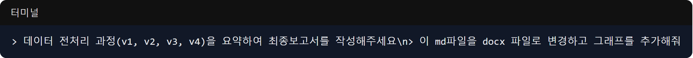

4월 5일은 그동안 진행해 온 고된 데이터 전처리 과정(v1~v4)을 갈무리하는 최종 보고서를 작성하고, 
동시에 본격적으로 마음지기 웹 서비스의 얼굴이 될 프론트엔드 프로젝트를 킥오프한 날입니다.

### 마크다운부터 DOCX, 그래프 생성까지 완벽한 문서화

- **문제**: 지도교수님과 팀원들에게 그동안의 방대한 전처리 과정을 시각적으로 이해하기 쉽게 공유해야 했습니다.
- **과정**: 
  > Claude Code에게: "데이터 전처리 과정(v1, v2, v3, v4)을 요약하여 최종보고서를 작성해주세요... 각 v별 대표 예시 추가해 줘."
  > "이 md파일을 docx 파일로 변경해주세요... 그래프로 표현 가능한 것들은 그래프로 추가해서 만들어줘."
- **결과**: 놀랍게도 AI는 그동안 작업했던 파이썬 코드와 JSON 데이터를 분석하여 핵심 요약 보고서를 마크다운으로 뚝딱 써냈습니다. 여기에 그치지 않고, 파이썬 라이브러리(`python-docx`, `matplotlib`)를 스스로 설치하고 스크립트를 짜더니 마크다운을 깔끔한 워드(DOCX) 파일로 변환하고 감정 분포 그래프까지 그려서 삽입해 주었습니다! 문서 작업에 허비되는 시간을 획기적으로 줄인 순간이었습니다.

### Next.js 기반 프론트엔드 프로젝트 킥오프

- **문제**: 인공지능 모델 훈련과 별개로, 사용자들이 실제로 챗봇과 대화할 수 있는 웹 인터페이스가 필요했습니다.
- **과정**: (백그라운드 작업) 사용자(장병)에게 친숙하고 빠른 UI를 제공하기 위해 Next.js 기반의 프론트엔드 프로젝트 세팅을 지시했습니다.
- **결과**: `maeumjigi/frontend/` 경로에 `package.json`, `tsconfig.json` 등이 생성되며 최신 트렌드인 Next.js 기반의 프론트엔드 환경이 성공적으로 세팅되었습니다. 

오늘은 AI의 능력이 단순히 코딩을 넘어 '문서 요약, 그래프 시각화, DOCX 파일 생성'이라는 훌륭한 사무보조 역할까지 완벽하게 수행할 수 있음을 증명한 날이었습니다. 
데이터 전처리라는 큰 산을 하나 넘고, 이제 본격적으로 사용자와 만날 프론트엔드 개발의 닻을 올렸습니다!
