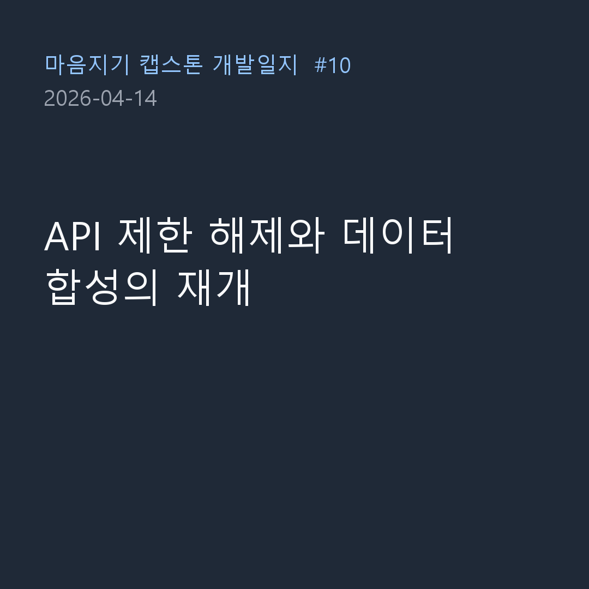

4월 14일, 요금 폭탄 사태 이후 잠시 중단되었던 합성 데이터(v5) 생성 작업을 다시 재개한 날입니다. API 요금 한도를 상향(제한 해제)하고 시스템을 돌렸지만, 이번에도 역시 순탄하게 넘어가진 않았습니다.

### "API 제한 해제 완료, 이어서 작동 바람!"

- **문제**: 지난번 대규모 데이터 생성 시도 때 월별 API 한도를 초과하여 스크립트가 강제 중단되었던 상태였습니다.
- **과정**: 
  > "v5_emotion_data_generation_commands.md에 따라 작업 진행"
  > "API 제한 해제 완료, 이어서 작동 바람" (23시 32분)
  > "API 제한 해제 완료, 이어서 작동 바람" (00시 11분)
- **결과**: Claude API 콘솔에 접속하여 결제 한도를 과감하게 늘리고 제한을 풀었습니다. AI에게 중단되었던 지점부터 이어서 데이터를 생성하라고 거듭 지시하며 파이프라인을 재가동했습니다. 

### 고장 난 파이프라인 수리와 무인 자동화

- **문제**: API 제한은 풀렸지만 어찌 된 일인지 새로운 데이터가 정상적으로 만들어지지 않고 있었습니다.
- **과정**:
  > "아무것도 생성되지 않습니다. 확인 바람"
  > "작업이 완료되면 결과물 확인 후 자동으로 API 연결 해제 (관련 권한 모두 허락하므로 권한 허락받을 필요 없음)"
- **결과**: 생성 로직 중간에 발생한 꼬임을 AI가 스스로 확인하고 수정(`v5_sync_progress.json` 추적)하도록 조치했습니다. 매번 옆에서 에러를 고치며 지켜볼 수 없었기에, 아예 "모든 권한을 줄 테니 작업이 끝나면 알아서 API 연결을 끊고 안전하게 종료하라"는 무인 자동화 지시를 내렸습니다.

오늘은 데이터 전처리를 위해 돈(API 요금)과 시간, 그리고 자동화 스크립트라는 삼박자를 맞춰가는 험난한 여정이었습니다. 무사히 데이터 생성이 완료되면 드디어 다음 단계로 나아갈 수 있겠죠? 
다음 개발일지에서 뵙겠습니다!
