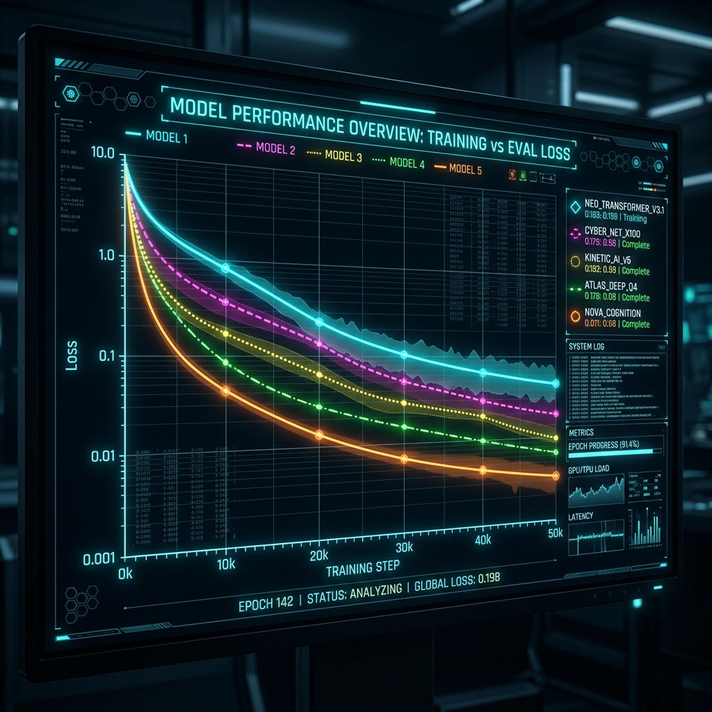

5월 7일은 그동안 피땀 흘려 파인튜닝한 총 5개의 모델(Llama3.3-70B, DSR1-70B, HCX-Omni-8B, Qwen35-9B, HCX-Text-1.5B)의 결과를 집대성하고, 본격적인 시각화와 로컬 환경 구성을 진행한 날입니다. 

### 모델 비교를 위한 시각화와 로컬 환경 세팅

그동안 무거운 서버에서 돌리던 결과 비교 코드를 이제 제 개인 노트북에서도 편하게 확인하기 위해 `31_comparison_local.ipynb` 노트북을 새롭게 작성했습니다.

> "30_comparison.ipynb은 내 노트북에서도 작동할 수 있지 않나?"
> "현재 선택된 kernel에 pandas, matplotlib, seaborn, bert_score를 설치하는 방법을 알려주세요."

VSCode에서 로컬 Jupyter 커널을 잡고 필요한 라이브러리들을 설치하는 과정에서 잦은 커널 충돌(Kernel Crashed)과 `ModuleNotFoundError: No module named 'ft_utils'` 같은 짜증 나는 에러들을 마주했지만, 차근차근 폴더 경로를 맞추며 해결해 나갔습니다. 일부 모델(DSR1-70B 등)에서 누락되었던 `ft_metrics.json` 파일도 스크립트를 통해 성공적으로 복구해 냈습니다.

### 5개 모델 종합 리포트 및 그래프 시각화

가장 중요한 작업은 이 5개 모델의 성능을 한눈에 비교할 수 있는 시각화였습니다. AI와 함께 `5MODELS_ORGANIZATION_PLAN_present.md`라는 계획서를 세우고 체계적으로 데이터 정리를 시작했습니다.

> "희미한 선과 굵은 선의 차이가 무엇인가? 각 모델별 training loss와 eval loss를 가져와서 전체 모델의 loss를 각각 그래프로 시각화하시오."
> "굵은 선은 없애고 희미한 선을 선명하게 변경하여 저장해 줘."

AI가 그려준 matplotlib 그래프에서 불필요한 추세선(굵은 선)을 제거하고, 모델별 Training Loss와 Eval Loss 곡선을 깔끔하게 한곳에 모은 `03_training_loss_all.png`와 `04_eval_loss_all.png`를 최종적으로 뽑아냈습니다. 또한 각 모델의 LoRA Rank 붕괴 현상(Rank Decomposition)을 분석한 그래프와 GPU 메모리 점유율 차트(`02_gpu_memory.png`)까지 완벽하게 문서화했습니다.

이제 이 그래프들을 바탕으로 다음 주 캡스톤디자인 중간발표 자료를 멋지게 꾸밀 수 있게 되었습니다. 과연 이 5개의 모델 중 어떤 모델이 가장 뛰어난 퀄리티의 '마음지기' 챗봇으로 최종 선정될까요?
