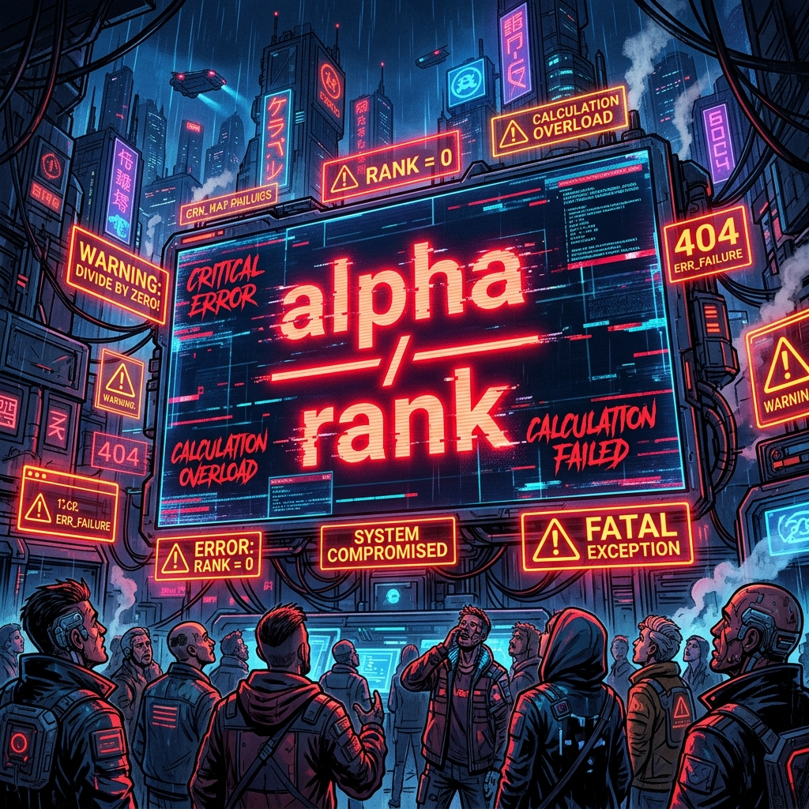

5월 8일은 그동안 뽑아낸 파인튜닝 결과들을 바탕으로 캡스톤디자인 중간 발표 자료(PPT)를 만들던 날이었습니다. 하지만 기분 좋게 슬라이드를 채워나가던 중, 등골이 서늘해지는 엄청난 실수를 발견하고 말았습니다.

### LoRA 하이퍼파라미터의 치명적 실수 발견

PPT에 들어갈 모델 구조도와 하이퍼파라미터 정보를 AI와 함께 다듬고 있었습니다.

> "파인튜닝 결과 예시를 보면 base model보다 답변이 짧아졌습니다. 이는 LoRA의 r을 8로 하고 alpha를 16으로 해서 중간 feature를 너무 줄이다 보니 답변이 짧아졌다고 생각이 드는데..."
> "아니 a/r 이었어? 나는 r/a라고 알고 있었는데...??? 나는 정말 LoRA를 욕심쟁이로 반영한 거구나..."

LoRA 파인튜닝 시 `alpha` 값은 보통 `rank` 값과 동일하거나 2배로 주는 것이 정석입니다. 그런데 계산식 적용 비율을 완전히 반대로 착각하여, 가중치 업데이트가 극단적으로 억눌리거나 과하게 튕겨버리게 세팅해 버린 것입니다. 어쩐지 파인튜닝된 모델의 답변 길이가 뚝뚝 끊기고 짧아지더라니, 원인은 바로 제 손끝에 있었습니다.

### 2차 파인튜닝 (fine_tuning_2) 결단

이미 1차 결과가 나왔지만, 완벽한 '마음지기'를 위해 이대로 넘어갈 순 없었습니다. 즉시 `fine_tuning_2` 폴더를 파고 2차 파인튜닝을 결단했습니다.

> "이번에 사용할 모델은 HCX-Text-1p5B, Llama33-70B, Qwen35-9B 입니다. MIG-0에서는 rank는 16, alpha는 16으로, MIG-1에서는 rank=16, a=8로 설정하여 학습 진행해 줘."
> "Daily_train_dataset.jsonl에서 가장 긴 데이터 상위 2000개를 뽑아서 Daily_train_dataset_long.jsonl이란 제목의 파일로 생성해 주세요."

답변이 짧아지는 현상을 방지하기 위해 가장 텍스트 길이가 긴 상위 2000개의 데이터셋만을 따로 추출하고, MIG(Multi-Instance GPU) 자원을 나누어 rank와 alpha 비율에 따른 성능 차이를 직접 비교하는 병렬 학습을 새롭게 돌리기 시작했습니다.

### 백엔드 모델이 도는 동안, 프론트엔드(앱) 개발 착수

모델이 다시 학습의 굴레에 빠진 동안, 저는 손을 놓고 있지 않았습니다. 드디어 실제 사용자들이 '마음지기'를 만나게 될 프론트엔드 앱 개발에 착수했습니다!

> "maeum-app을 구동하기 위해 QR코드를 시현해야 하는데... npx go start를 입력해도 에러 메시지만 시현돼. 어떻게 그리고 어디에 QR코드가 시현될 수 있을까?"

React Native(Expo)를 이용해 `maeum-app` 프로젝트를 생성하고 로컬 서버를 띄워 스마트폰과 연결하려 고군분투했습니다. 엉뚱하게 `npx go start`를 치며 헤매기도 했지만, 마침내 Expo QR 코드를 띄우고 앱 아이콘(`assets/logo.png`)을 세팅하는 데 성공했습니다. 백엔드의 두뇌(AI)와 프론트엔드의 얼굴(App)이 동시에 만들어지고 있는 가슴 벅찬 하루였습니다.
