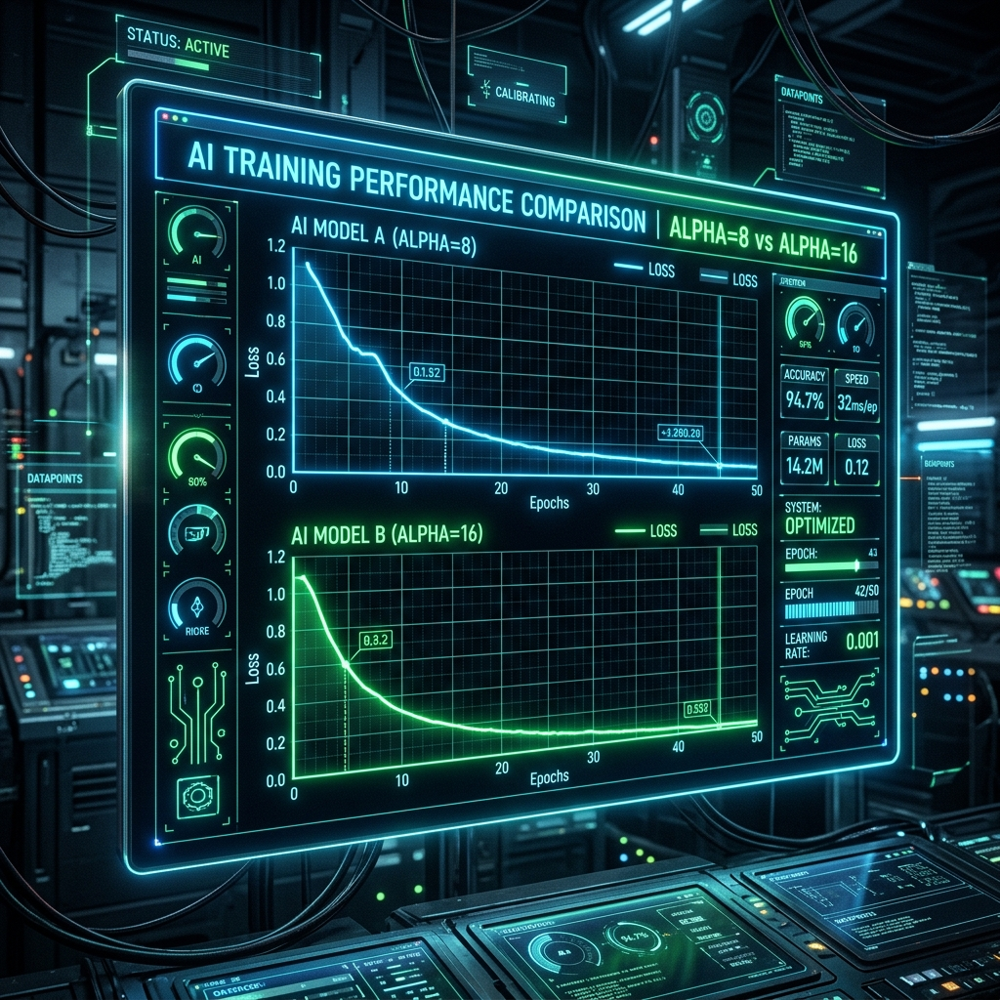

어제 발견했던 하드코딩 버그를 모두 고치고, 드디어 제대로 된 2차 파인튜닝 모델들의 추론(Inference) 테스트를 재개한 5월 13일입니다.

### 짧은 답변의 원인, 토큰 길이를 늘려라!

추론 결과를 하나씩 뜯어보던 중, `Llama33-70B_a8` 모델이 내놓은 답변이 여전히 묘하게 짧고 딱딱하다는 것을 느꼈습니다.

> "이것은 Llama33-70B_a8의 답변 중 하나입니다. max_seq_length와 max_new_tokens이 너무 적다고 느껴집니다. 늘리고 싶네요. VRAM 현황을 보면 얼마나 늘릴 수 있나요?"

AI와 VRAM 여유 공간(당시 39.8GB)을 계산한 끝에, 생성할 수 있는 최대 단어 수인 `max_new_tokens`를 384로 과감하게 상향 조정했습니다. 결과는 대성공이었습니다! 

```text
[변경 전] "그런 생각이 드신다니 정말 힘드시겠어요. 전문가와 이야기 나누는 것이 중요합니다."
[변경 후] "그런 생각이 드신다니 정말 힘드시겠어요. 하지만 그런 생각이 드는 것은 당신이 약해서가 아니라 지금 너무 많은 부담을 지고 계신다는 신호입니다. 전문가와 함께 이런 감정들을 천천히 풀어보시는 것을 권해드립니다."
```

단지 토큰 허용치만 늘려주었을 뿐인데, 모델이 문맥을 끝까지 유지하며 훨씬 더 깊이 있고 따뜻한 공감의 문장들을 쏟아내기 시작했습니다. 제한된 토큰 수에 갇혀 모델이 스스로 말을 아끼고 있었던 셈입니다.

### Alpha 값 비교 분석 (a=8 vs a=16)



2차 파인튜닝의 가장 큰 목적이었던 LoRA 하이퍼파라미터 `alpha` 값에 따른 성능 차이도 결과가 나왔습니다. `fine_tuning_2` 폴더에 쌓인 로그를 분석하여 `05_alpha_comparison_daily.png` 등의 그래프를 생성해 냈습니다. `rank=16`으로 고정된 상태에서 `alpha=8`을 주었을 때와 `alpha=16`을 주었을 때, 모델의 과적합(Overfitting) 양상과 최종 답변 퀄리티가 어떻게 달라지는지 명확하게 시각화할 수 있었습니다. 

결과적으로 올바른 하이퍼파라미터와 넉넉한 토큰 길이를 부여받은 모델들은 드디어 저희가 애초에 기획했던 '진정한 마음지기'의 모습에 가까워지고 있었습니다. 중간발표 준비가 아주 순조롭게 마무리될 것 같습니다!
